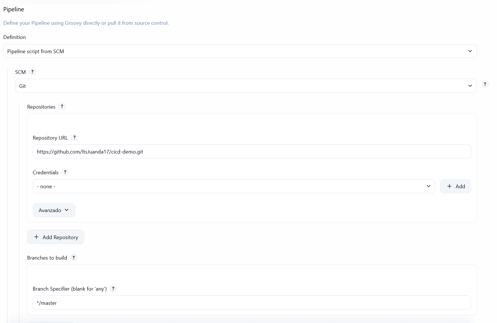
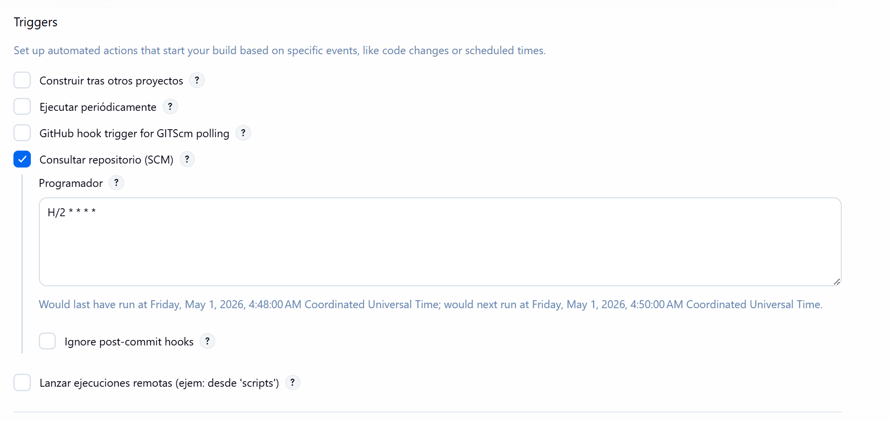
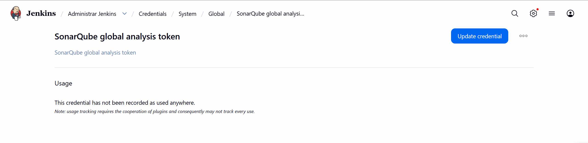
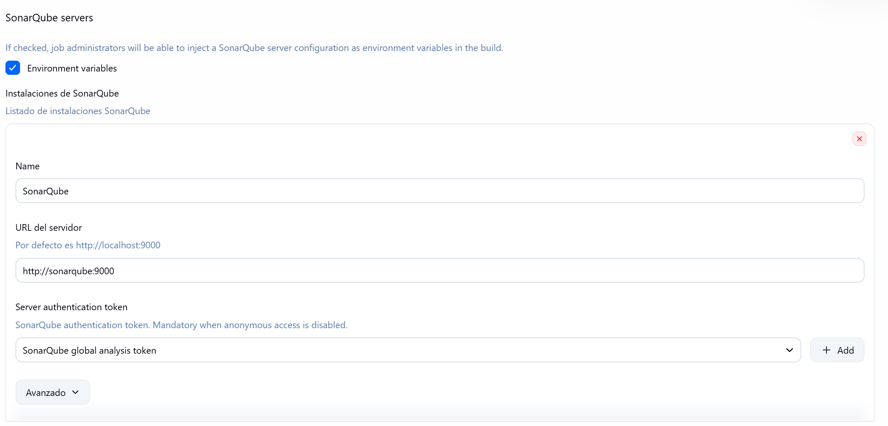
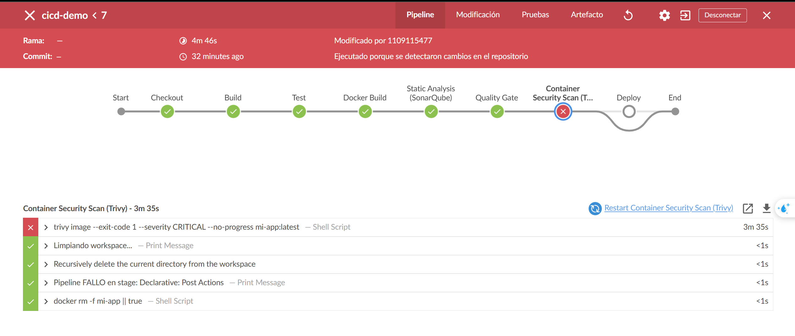
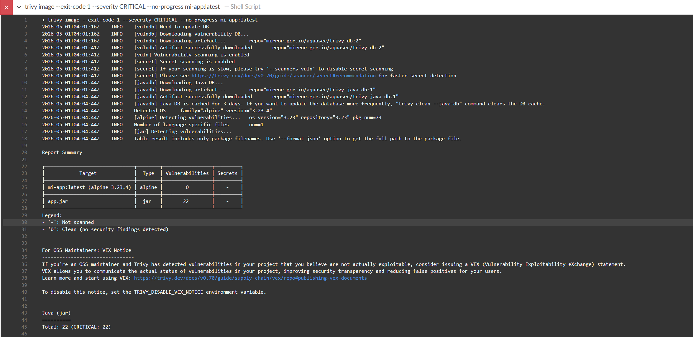
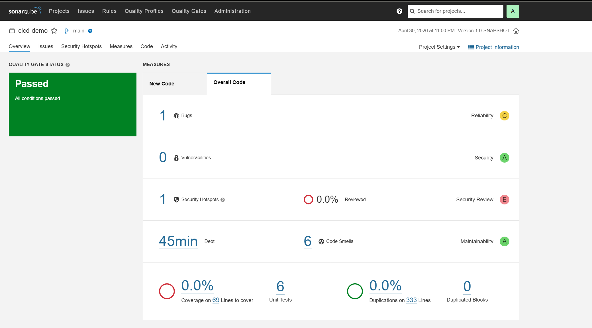
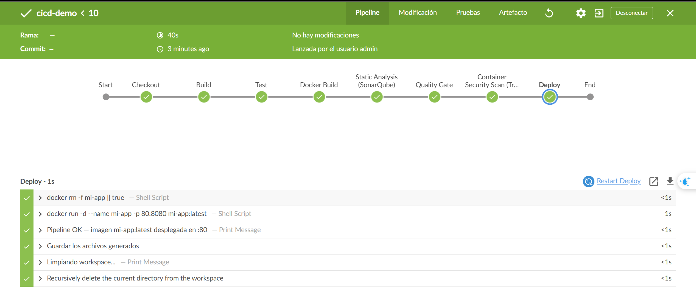
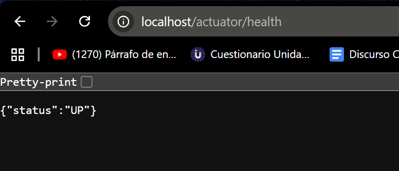

# CICD-DEMO

**Integrantes:** Juan David Acevedo · Juan Camilo Muñoz

Esqueleto base para practicar CI/CD: una app Spring Boot, un `Jenkinsfile`
declarativo y los servicios de soporte (SonarQube, Trivy) corriendo
localmente en contenedores. El pipeline construye, prueba, analiza y
despliega la imagen siempre que pase las puertas de calidad y de seguridad.

## Componentes del entorno

| Componente | Rol | Acceso local |
|---|---|---|
| Jenkins | Orquesta el pipeline; corre en contenedor con el `docker.sock` del host montado | http://localhost:8080 |
| SonarQube | Análisis estático y *Quality Gate* | http://localhost:9000 |
| Trivy | Escaneo de vulnerabilidades de la imagen Docker (CLI dentro del contenedor Jenkins) | CLI |
| `mi-app` | Imagen Docker de la app Spring Boot que el pipeline construye y despliega | http://localhost:80 |

El repo también incluye un `Makefile`, `docker-compose.yml`, manifiestos
de Kubernetes en [`k8s-config/`](./k8s-config) y el pipeline original con
despliegue a K8s en [`Jenkinsfile.original`](./Jenkinsfile.original) — todo
eso queda como referencia; el flujo activo es el de [`Jenkinsfile`](./Jenkinsfile).

## Pipeline CI/CD (Jenkins)

### Flujo del Pipeline

| # | Stage | Acción | Falla si... |
|---|---|---|---|
| 1 | `Checkout` | Clona el repo desde el SCM configurado en el job | el clon falla |
| 2 | `Build` | `mvn -B -DskipTests clean package` | la compilación o el packaging fallan |
| 3 | `Test` | `mvn -B test` y publica reportes JUnit | algún test unitario falla |
| 4 | `Docker Build` | `docker build -t mi-app:latest .` | el build de imagen falla |
| 5 | `Static Analysis (SonarQube)` | `mvn -B sonar:sonar` con `withSonarQubeEnv` | el escaneo no puede subir resultados |
| 6 | `Quality Gate` | `waitForQualityGate abortPipeline: true` | SonarQube reporta Quality Gate **fallida** (incluye Security Hotspots no revisados) |
| 7 | `Container Security Scan (Trivy)` | `trivy image --exit-code 1 --severity CRITICAL` | la imagen tiene **alguna** vulnerabilidad CRITICAL |
| 8 | `Deploy` | `docker run -d --name mi-app -p 80:8080 mi-app:latest` (previo `docker rm -f`) | no logra levantar el contenedor |

### Manejo de errores y limpieza

El bloque `post` deja el entorno consistente en cualquier resultado:

- `post.success`: archiva el `.jar` en `target/` y registra el despliegue.
- `post.failure`: imprime el stage que rompió y elimina el contenedor `mi-app`
  si quedó a medio desplegar (`docker rm -f mi-app || true`).
- `post.always`: limpia el workspace de Jenkins (`cleanWs()`).

### Pre-requisitos del agente Jenkins

Para que el pipeline funcione end-to-end el contenedor Jenkins necesita:

- Acceso al socket Docker del host
  (`-v /var/run/docker.sock:/var/run/docker.sock`).
- Docker CLI instalado dentro del contenedor.
- Trivy CLI instalado dentro del contenedor.
- Conectividad de red al contenedor `sonarqube` (red Docker compartida).
- Una credencial Jenkins llamada `SonarQube` (token generado en SonarQube)
  registrada vía *Manage Jenkins → System → SonarQube servers*.

### Cómo configurar el Job en Jenkins

1. *New Item* → tipo **Pipeline** → nombre `cicd-demo`.
2. En la sección *Pipeline*: Definition **Pipeline script from SCM**, SCM
   **Git**, Repository URL `https://github.com/ItsJuanda17/cicd-demo.git`,
   Branch Specifier `*/master`, Script Path `Jenkinsfile`.
   
3. **Build Trigger** *Poll SCM* con `H/2 * * * *` para que Jenkins detecte
   cambios en el repo cada 2 min.
   
4. **Credencial del token de SonarQube** registrada en
   *Manage Jenkins → Credentials* (tipo *Secret text*).
   
5. **SonarQube Server** registrado en *Manage Jenkins → System*, apuntando a
   `http://sonarqube:9000` y consumiendo la credencial anterior. Esto es
   lo que `withSonarQubeEnv('SonarQube')` lee desde el `Jenkinsfile`.
   
6. *Save* → *Build Now*.

### Evidencia de ejecución

Las capturas y los logs completos de cada escenario están en
[`entregables/`](./entregables).

#### Escenario 1 — Falla por vulnerabilidades CRITICAL (build #7)

La primera versión del pipeline ejecutaba `trivy image --severity CRITICAL`
sobre toda la imagen. La capa de la app contenía dependencias Java
desactualizadas (`jackson-databind`, `tomcat-embed`, `spring-*`) con CVEs
CRITICAL, así que la puerta de seguridad detuvo el flujo antes del Deploy. Se ajusto de esta manera para evidenciar el comportamiento de *gatekeeping* que pide el ejercicio.




Log completo: [entregables/logs/build-7-fallo-trivy.txt](entregables/logs/build-7-fallo-trivy.txt).

#### Escenario 2 — Quality Gate de SonarQube

Después del análisis estático, la stage `Quality Gate` espera el resultado
de SonarQube y aborta el pipeline si la quality gate falla (incluyendo
*Security Hotspots* sin revisar).



#### Escenario 3 — Ejecución exitosa y app desplegada (build #10)

Tras restringir el escaneo de Trivy a la capa OS (`--pkg-types os`), el
pipeline corre completo: build → test → docker build → análisis Sonar →
quality gate → trivy → deploy.




Log completo: [entregables/logs/build-10-verde.txt](entregables/logs/build-10-verde.txt).

## Ejecutar la app localmente

### Opción 1: Compilar y ejecutar sin contenedores (desarrollo local)

**Requisitos previos:**

**Pasos:**

```bash
# Compilar la aplicación
mvn clean package

# Ejecutar la app
java -jar target/cicd-demo-1.0-SNAPSHOT.jar
```

La app estará disponible en `http://localhost:8080`.

Endpoints disponibles:
- `GET http://localhost:8080/` — información básica del entorno (hostname, IP, OS)
- `GET http://localhost:8080/users` — lista de usuarios
- `GET http://localhost:8080/users/{id}` — obtener usuario por `id`
- `POST http://localhost:8080/users` — crear un usuario (body JSON)
- `GET http://localhost:8080/actuator/health` — estado de la app (actuator)
- `GET http://localhost:8080/config` — configuración (property `application.name`)

### Opción 2: Ejecutar con Docker (sin Jenkins)

**Requisitos previos:**
- Docker 20.10+
- Maven 3.6+ (para compilar)

**Pasos:**

```bash
# 1. Compilar la app
mvn clean package

# 2. Construir imagen Docker
docker build -t mi-app:latest .

# 3. Ejecutar el contenedor
docker run -d --name mi-app -p 8080:8080 mi-app:latest

# 4. Verificar que está corriendo
curl http://localhost:8080/actuator/health

# 5. Para detener
docker stop mi-app
docker rm mi-app
```

### Opción 3: Stack completo con docker-compose (Jenkins + SonarQube + App)

**Requisitos previos:**
- Docker 20.10+
- Docker Compose 2.0+

**Pasos:**

```bash
# 1. Levantar todos los servicios
docker-compose up -d

# 2. Acceder a los servicios
# - Jenkins: http://localhost:8080 (espera a que inicialice, puede tardar 30s-1min)
# - SonarQube: http://localhost:9000
# - App (después del primer build): http://localhost:80

# 3. Ver logs
docker-compose logs -f jenkins

# 4. Detener servicios
docker-compose down

# 5. Detener y eliminar volúmenes (limpieza completa)
docker-compose down -v
```

**Nota:** La primera vez que se levanta el docker-compose, Jenkins demorará en inicializar.
Consulta los logs con `docker-compose logs jenkins` para seguir el progreso.

### Job exportado

El `config.xml` del job de Jenkins quedó versionado en
[`entregables/jenkins-job/config.xml`](entregables/jenkins-job/config.xml).
Para reproducir el job en otro Jenkins basta con copiar ese archivo dentro
del contenedor y recargar la configuración:

```bash
docker exec jenkins mkdir -p /var/jenkins_home/jobs/cicd-demo
docker cp entregables/jenkins-job/config.xml jenkins:/var/jenkins_home/jobs/cicd-demo/config.xml
docker exec jenkins curl -s -X POST http://localhost:8080/reload
```

